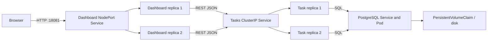

# Cloudboard

A small task board built from two Python REST microservices and a separate PostgreSQL database. Create tasks, choose a priority, move tasks between To do / In progress / Done, and see completion statistics in a browser.

Source: [runlinlong/cloudboard](https://github.com/runlinlong/cloudboard). Images: [task service](https://hub.docker.com/r/runlinlong/cloudboard-tasks) and [dashboard service](https://hub.docker.com/r/runlinlong/cloudboard-dashboard). On the configured local machine: [open the Kubernetes application](http://127.0.0.1:18081).

**AI-assisted project draft for review.** Source code, configuration, and documents in this project were generated with AI assistance. Read [the disclosure](docs/AI-DISCLOSURE.md) and your course policy before using any part in a submission. Review is not a substitute for a policy that prohibits AI-generated source code.

## Components

| Component | Responsibility | Implementation |
|---|---|---|
| Dashboard service | Browser UI, REST gateway, progress aggregation; calls the task service over HTTP | `services/dashboard/app.py`, HTML/CSS/JS |
| Task service | Task validation and CRUD; sole owner of task database access | `services/tasks/app.py` |
| PostgreSQL | Transactional task storage | Official `postgres:17-bookworm` image and a persistent volume |



## Start here (Windows / PowerShell)

Project interpreter: `.venv\Scripts\python.exe`. In PyCharm, use **Settings → Project → Python Interpreter → Add local interpreter → Existing** and select that file. This environment is independent of other Python projects. Container execution uses its own Linux Python environment.

Docker Desktop must already be running with Linux containers. **No script restarts or resets Docker Desktop or WSL.** Existing coursework containers are not managed by this project. Do not run Docker system prune, factory reset, volume deletion, or cluster deletion while preserving coursework data.

```powershell
cd F:\pycharm\project\cloud
.\scripts\init-local.ps1
.\.venv\Scripts\python.exe -m pytest -q
```

If PowerShell blocks local scripts, use `powershell -ExecutionPolicy Bypass -File .\scripts\init-local.ps1` for this invocation. Do not change machine-wide execution policy.

### Optional Docker Compose smoke test

```powershell
docker compose -p cloudboard-coursework up -d --build --wait
```

Open <http://127.0.0.1:18080>. The database and task service have no published host ports. This is useful for debugging but **does not satisfy the Kubernetes demonstration**. To stop only these three project containers while retaining their database volume:

```powershell
docker compose -p cloudboard-coursework stop
```

### Kubernetes local rehearsal

Requires [kind](https://kind.sigs.k8s.io/docs/user/quick-start/); it can be a standalone `.local\kind.exe` or on PATH. It creates a NEW cluster named `cloudboard-coursework` and writes a private kubeconfig into this project, without changing your global kubeconfig. This cluster shares the Docker engine and machine resources; namespacing is not a resource or security boundary against the host.

```powershell
.\scripts\create-cluster.ps1
docker build -f services/tasks/Dockerfile -t cloudboard-tasks:dev .
docker build -f services/dashboard/Dockerfile -t cloudboard-dashboard:dev .
.\.local\kind.exe load docker-image cloudboard-tasks:dev cloudboard-dashboard:dev --name cloudboard-coursework
.\scripts\deploy.ps1 -LocalImages
```

If kind is installed on PATH instead, replace `.\.local\kind.exe` with `kind`.

Open <http://127.0.0.1:18081>. The kind port mapping binds to loopback. Only this project uses ports 18080/18081; cluster API uses its own allocated port. Check for conflicts before creating the cluster.

### Submission deployment: images MUST come from Docker Hub

Register your own Docker Hub account. Create **public** repositories `cloudboard-tasks` and `cloudboard-dashboard`, then authenticate personally (do not share passwords or tokens):

```powershell
docker login
.\scripts\publish.ps1 -DockerHubUser YOUR_USERNAME -Tag v1
.\scripts\deploy.ps1 -DockerHubUser YOUR_USERNAME -Tag v1
```

The second command builds and pushes both images and verifies their remote manifests. The final command uses `docker.io/YOUR_USERNAME/...:v1` with `imagePullPolicy: Always`; it fails rather than silently falling back to the local rehearsal images. Use a new version tag for changes. Record registry digests in the submission. A non-amd64 target cluster requires appropriate multi-platform image builds.

For another Kubernetes cluster with a default StorageClass, pass `-Kubeconfig PATH -Context NAME` explicitly to `deploy.ps1`. The NodePort URL depends on the cluster. A local browser alternative is:

```powershell
kubectl --kubeconfig .local/kubeconfig --context kind-cloudboard-coursework -n cloudboard port-forward service/dashboard 18082:80
```

Then open <http://127.0.0.1:18082>. Port-forward pins traffic to a selected dashboard Pod; use the NodePort to demonstrate balancing between dashboard replicas.

## Tests and demonstration

```powershell
$env:CLOUDBOARD_TEST_URL = 'http://127.0.0.1:18081'
.\.venv\Scripts\python.exe -m pytest -q
.\scripts\verify-kubernetes.ps1
```

The live test creates and removes only its own test task. The verification script scales the TWO application deployments independently, restarts only this project's PostgreSQL deployment, verifies task survival, and restores application replica counts. It does not restart the Docker engine or another project.

```powershell
kubectl --kubeconfig .local/kubeconfig --context kind-cloudboard-coursework -n cloudboard get deployments,pods,services,pvc
kubectl --kubeconfig .local/kubeconfig --context kind-cloudboard-coursework -n cloudboard logs -l app=dashboard --tail=20 --prefix
kubectl --kubeconfig .local/kubeconfig --context kind-cloudboard-coursework -n cloudboard logs -l app=tasks --tail=20 --prefix
```

See [verification evidence](docs/VERIFICATION.md), [architecture review draft](docs/ARCHITECTURE.md), [Chinese walkthrough](docs/START-HERE-ZH.md), and [7–8 minute video plan](docs/VIDEO-PLAN.md).

## API

All payloads use JSON. The dashboard proxies the task resource endpoints to the task API using Python `requests`. The dashboard also owns its separate aggregation endpoint.

| Method | URL | Purpose |
|---|---|---|
| GET | `/api/tasks` | List tasks |
| POST | `/api/tasks` | Create with `{"title":"Review deployment","priority":"high"}` |
| GET | `/api/tasks/{id}` | Fetch a task |
| PATCH | `/api/tasks/{id}` | Change status using `{"status":"done"}` |
| DELETE | `/api/tasks/{id}` | Delete a task |
| GET | `/api/dashboard` | Dashboard-only: tasks, counts, completion percentage, serving instances |
| GET | `/healthz` | Liveness: process can respond |
| GET | `/readyz` | Task readiness checks database; dashboard readiness checks its own availability |

## Persistence and limitations

The PostgreSQL PVC exists independently of the Deployment. Deployment replacement reuses it. Deployment scripts set the bound PV reclaim policy to `Retain`. In the local kind cluster the volume resides on the node's Docker storage: it survives Pod replacement and ordinary node-container restarts, **not destruction of the cluster/node storage, Docker factory reset, disk failure, or volume deletion**. Production requires durable CSI-backed storage and tested off-machine backups; a PVC alone is not disaster recovery. Compose and Kubernetes use separate databases.

This is a local classroom demonstration: **no login, authorization, TLS, tenancy, rate limiting or automated backups**. Every visitor can modify all tasks. Database credentials are passed using a Secret; Secrets are not automatically encrypted merely because values are base64 encoded. The demo uses the initial PostgreSQL database owner; production should use a separate restricted application role and controlled migrations. Do not expose this demonstration to the public Internet unchanged.

## Repository and final delivery

The public source repository is https://github.com/runlinlong/cloudboard. `.env`, `.venv`, `.local`, IDE files and generated artifacts are excluded by `.gitignore`.

Pending submission items are listed in [SUBMISSION-CHECKLIST.md](docs/SUBMISSION-CHECKLIST.md). Record an actual 5–10 minute demonstration yourself; the video plan is not a recording.

A 9:22 automated reference recording with synthetic narration is available **locally only** at `artifacts/cloudboard-demo.mp4`, with a local transcript at `artifacts/video-transcript.md`. It was not uploaded. The student plans to record their own final explanation using this reference. See [the delivery index](docs/DELIVERY.md).
